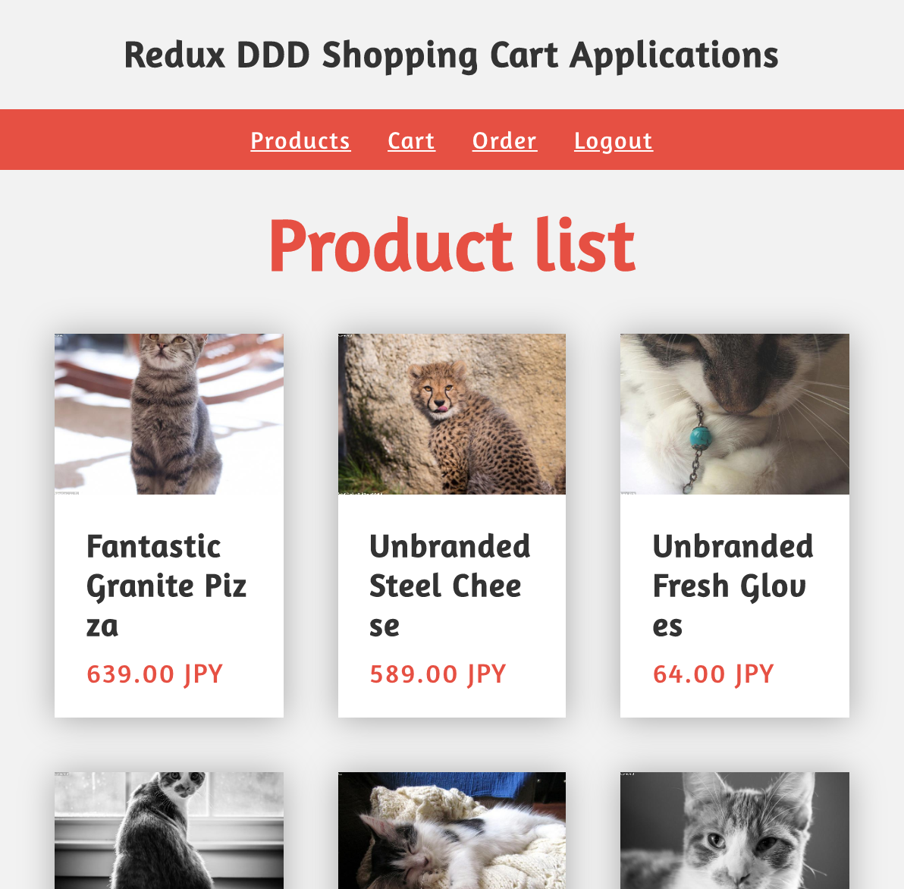

# Redux DDD Sample Applications



## 概要と背景

* 「ドメイン駆動設計」をReact / Reduxで実装した、学習用リポジトリです。
* 実装サービス例として、ショッピングWebアプリを作成しました。
  * 「商品一覧、商品詳細、カート、注文、注文履歴、ログイン、サインアップ」で構成されています。
  * Node.jsでモックAPIも実装しています。したがって、ローカル環境を立ち上げることでのみ、表示することができます。

### 基本的な npm scripts
```zsh
# package install (required)
$ yarn

# generate json database (required)
$ yarn init:db

# open local server & watch (required)
$ yarn watch

# compile files for preview upload. output files in public
$ yarn preview

# compile files for live upload. output files in htdocs
$ yarn release

#------- options -------

# lint pug, stylus, javascript
$ yarn lint

# format stylus, javascript
$ yarn format

```

### 基本的なページ導線

1. `/signup/`にて、顧客情報を登録する
2. `/login/`にて、ログインする
3. `/products/`にて、商品を選択する
4. `/product/`にて、商品をカートに入れる
5. `/cart/`にて、数量を変更し、決済に進む
6. `/payment/`にて、注文を確定する
7. `/order/`にて、注文済みの情報を確定する

※ `クレジットカード入力項目`が含まれますが、ダミーで入力してください。


### 依存サービスやパッケージ

本アプリは、以下のサービスやパッケージに依存しています。

#### 開発環境編

* Babel 7
* Webpack 4
* Flow / Glow
* Prettier
* stylus-supremacy
* ESLint
* stylint
* puglint
* JSON Server
* nodemon
* husky
* lint-staged

その他、拡張CLIコマンド等があります。

#### Webアプリ編

* React
* Redux
* Redux Saga
* Redux Form
* Immutable.js
* Recompose
* Lodash

その他、拡張系パッケージ等があります。

## TODO

* Unit / Component Testing (Jest)
* StoryBook

## その他のドキュメント

* [ディレクトリ構成について](https://i-studio.commits.jp/ist-tech/rrd-boilerplate/blob/master/docs/directory.md)
* [開発環境Tips](https://i-studio.commits.jp/ist-tech/rrd-boilerplate/blob/master/docs/tips.md)